# iOS 单元测试

> 单元测试是指开发者编写代码，去验证被测代码是否正确的一种手段，其实就是用代码去检测代码。合理的利用单元测试可以提高软件的质量。

  在 `iOS` 开发中， `Xcode` 集成了对测试功能的支持，其中单元测试使用的是 `XCTest` 框架 `<XCTest/XCTest.h>` ，因此本文档将以 `<XCTest/XCTest>` 框架对 `iOS` 开发中的单元测试进行说明讲解。
  

### 一、快速集成单元测试模块


#### 1.1 对于新建项目/工程集成单元测试模块

在新建项目/工程是，勾选 `Include Unit Tests` 即可在项目中集成单元测试模块。 还可以勾选 `Include UI Tests` 来集成 `UI` 测试，如下图：

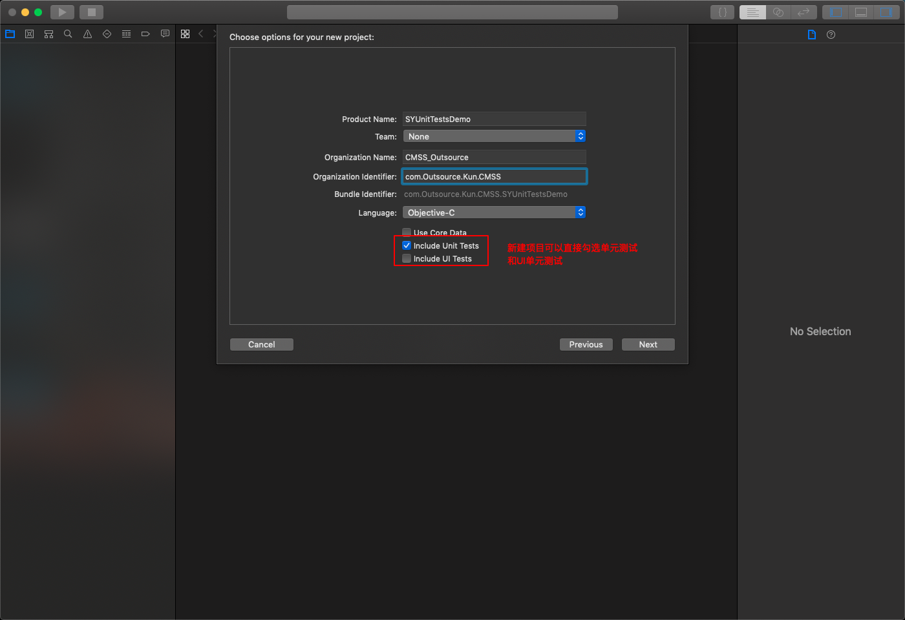

#### 1.2 对于已存在的项目快速添加单元测试模块

对于已没有集成单元测试的的项目/工程，也可以通过 `Xcode` 导航菜单中选择 `File` -> `New` -> `Target` -> 选择 `ios-test` -> 选择 `iOS Unit Testing Bundle` 新建一个测试 `target` -> `Next` -> `Finish` ，如下图：

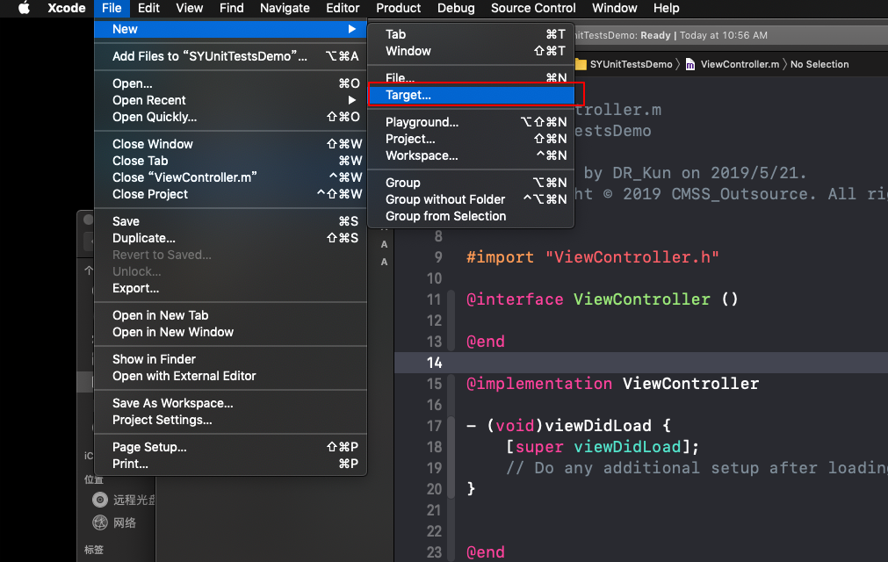

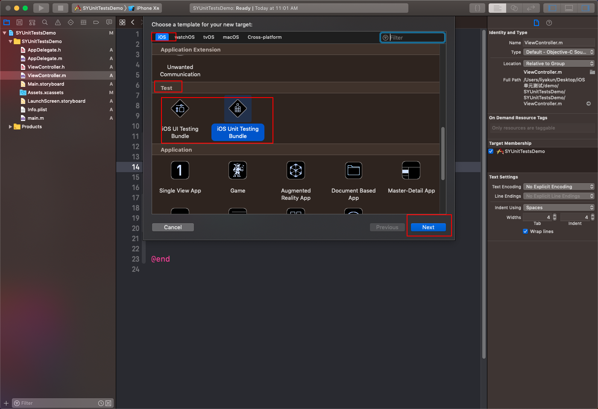

#### 1.3 单元测试代码说明
通过 `1.1` 或者 `1.2` 的操作后，下载项目中应该已经存在了单元测试的默认代码，如下图(`xxxTests`, xxx 为你项目的名称本文档中为 SYUnitTestsDemo，后面没有特殊说明，工程名均以 SYUnitTestsDemo 进行代替)，

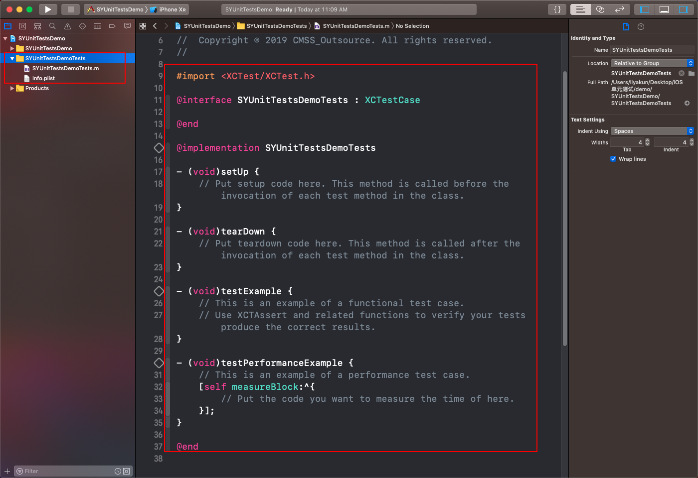

对于后续要进行单元测试的代码，可以选择在 `SYUnitTestsDemoTests` 文件夹下通过快捷键 `cmd + N` 添加文件， 选择 `iOS` -> `Unit Tests Case Class` 添加新的测试类，如下图所示：

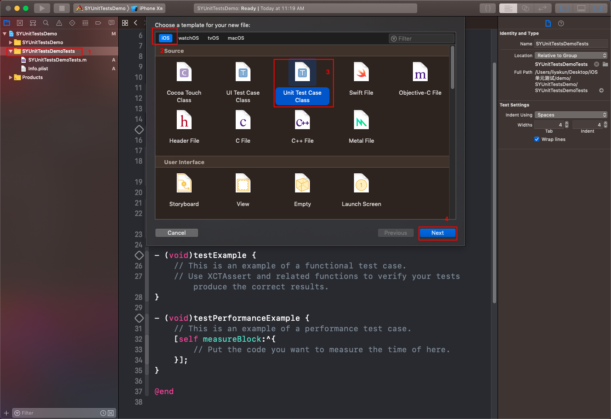

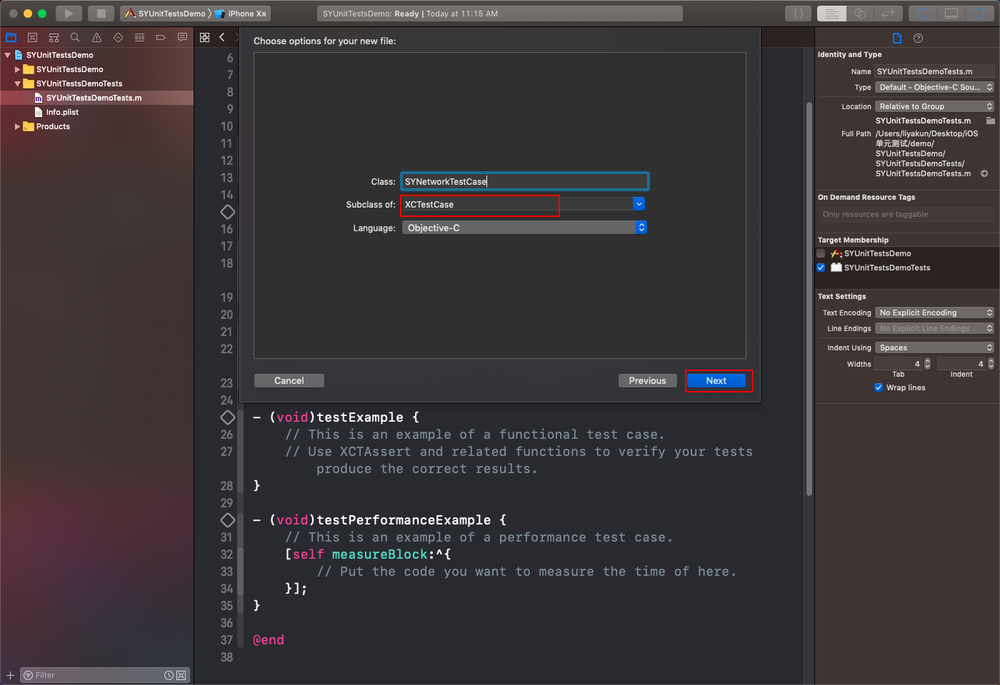

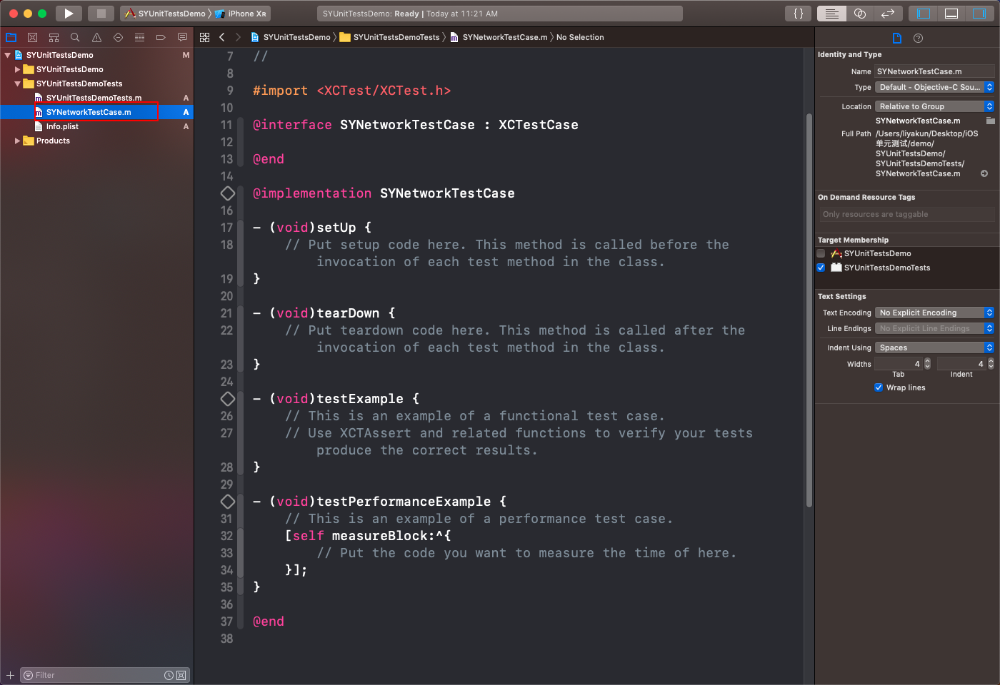

所有单元测试代码都应遵循如下规则

* 所有的测试类需要继承 `XCTestCase`，如：
    
    ```
    @interface SYNetworkTestCase : XCTestCase
	 
	@end
    ```

* 测试方法命名以 `test` 开始并且返回值必须为 `void`，即：该类中以 `test` 开头且以 `void` 返回的方法都会变成单元测试用例。

* 用 `Assertion API` 进行验证是否通过(请在 `断言` 目录下查看更为具体的说明)，例子如下：

    ```
    - (void)testExample {
    	// This is an example of a functional test case.
    	// Use XCTAssert and related functions to verify your tests produce the correct results.
    	//设置变量和设置预期值
    	NSUInteger a = 10;NSUInteger b = 15;
    	NSUInteger expected = 25;
    	//执行方法得到实际值
    	NSUInteger actual = [self add:a b:b];
    	//断言判定实际值和预期是否符合
    	XCTAssertEqual(expected, actual,@"add方法错误！");
	}

	-(NSUInteger)add:(NSUInteger)a b:(NSUInteger)b{
    	return a + b;
	}
    ```

* `-setUp` 和 `tearDown` 方法：

	```
	//每次测试前调用，可以在测试之前创建在 test case 方法中需要用到的一些对象等
	- (void)setUp ;
	//每次测试结束时调用
	- (void)tearDown ;
	```

#### 1.4 断言 API

```
//通用断言
XCTAssert(expression, format...)
//常用断言：
XCTAssertTrue(expression, format...)
XCTAssertFalse(expression, format...)
XCTAssertEqual(expression1, expression2, format...)
XCTAssertNotEqual(expression1, expression2, format...)
XCTAssertEqualWithAccuracy(expression1, expression2, accuracy, format...)
XCTAssertNotEqualWithAccuracy(expression1, expression2, accuracy, format...)
XCTAssertNil(expression, format...)
XCTAssertNotNil(expression, format...)

XCTFail(format...) //直接Fail的断言
```    

#### 1.5 其他

* 单元测试的规范式写法为：1. 定义变量和预期; 2. 执行方法得到实际值; 3. 断言;

* 对不同的类型做单元测试，规范式做法是针对不同类创建与之对应的新的测试类进行测试;

### 二、启用测试

#### 2.1 通用的单元测试方法启动方式

如 `1.3` 中所举例子一样写出你想要进行单元测试的用例后，启动单元测试的方法如下：

* 代码编辑器边栏菱形按钮，测试单个用例

* Test 导航栏，测试单个用例

* 快捷键⌘ + U测试全部用例

* 使用命令行工具 xcodebuild 可以测试单个用例，也可以测试全部用例。

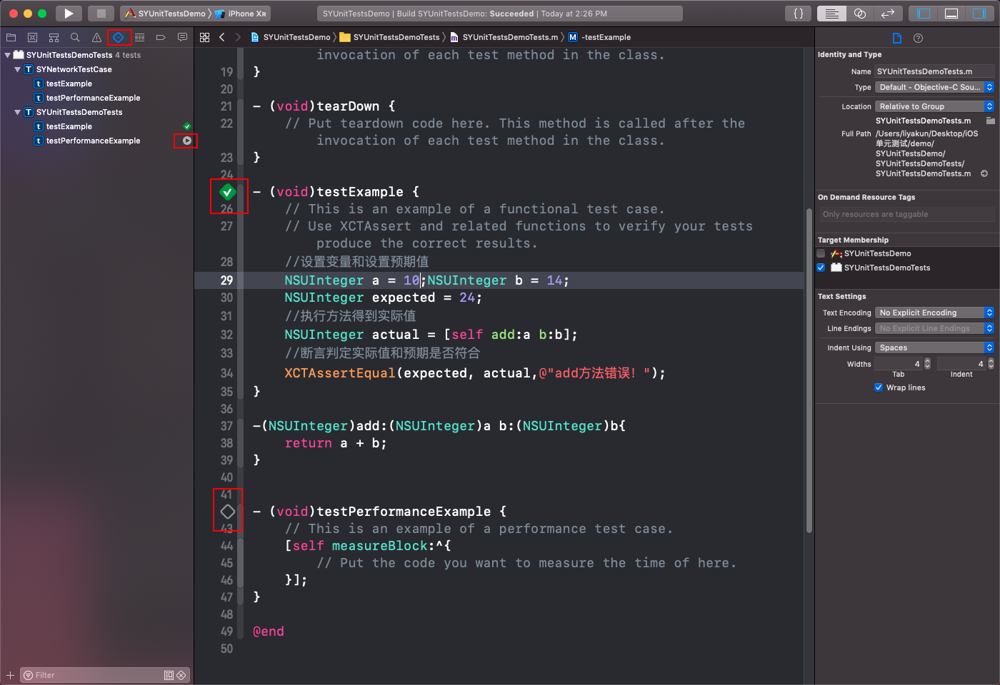

注意：有些测试方法可能会比较耗时如性能测试，异步测试等，因此测试方法并不是立即返回结果(即使这是 `Xcode` 会 `toase` 提醒 `Build Success` )，你需要等待期执行结束(顶部导航栏和侧边栏中的等待状态结束)如下所示为性能测试等待结果的图片;

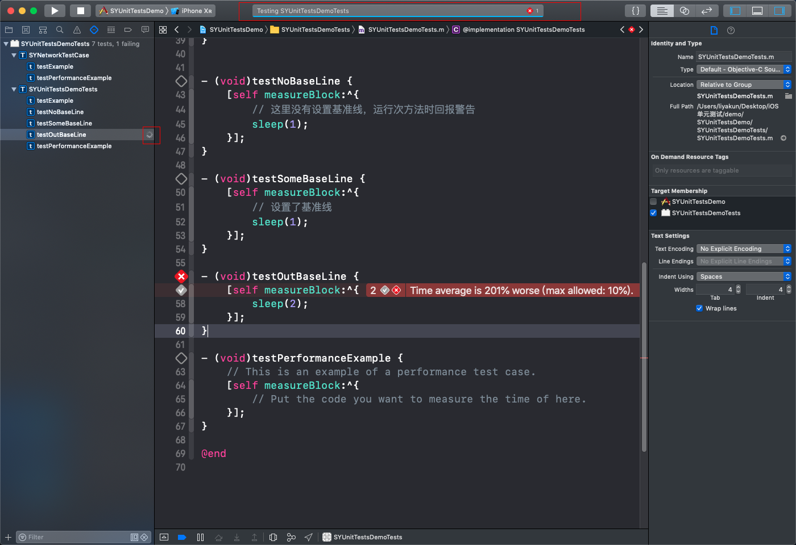


### 三、性能测试

> 性能测试通过度量代码块执行所消耗的时间长短，来衡量是否通过测试。

#### 3.1 相关 API

* `measureBlock:`

	```
	- (void)testPerformanceOfMyFunction {
	
	    [self measureBlock:^{
	        // Do that thing you want to measure.
	        //你的性能测试的代码放在这里,如下面的 myFunction()
	        myFunction();
	    }];
	}
	```
* `measureMetrics:automaticallyStartMeasuring:forBlock:`

	
	```
	- (void)testMyFunction2_WallClockTime {
	    [self measureMetrics:[self class].defaultPerformanceMetrics automaticallyStartMeasuring:NO forBlock:^{
	
	        // Do setup work that needs to be done for every iteration but you don't want to measure before the call to -startMeasuring
	        SetupSomething();
	        [self startMeasuring];
	
	        // Do that thing you want to measure.
	        MyFunction();
	        [self stopMeasuring];
	
	        // Do teardown work that needs to be done for every iteration but you don't want to measure after the call to -stopMeasuring
	        TeardownSomething();
	    }];
	}
	```

#### 3.2 设置基准线

所有的性能测试需要设置一个 `Baseline` 来验证是否通过测试，没有设置的会提示 `No baseline average for Time` 。

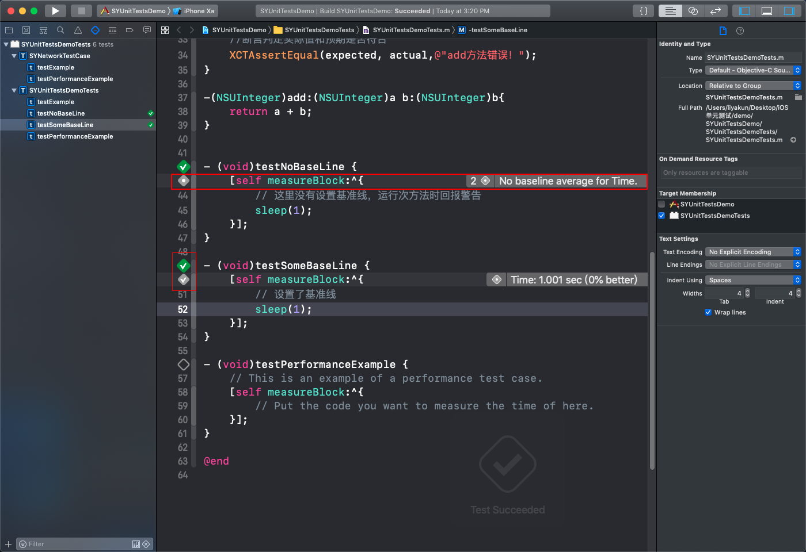

我们可以通过点击 `measureBlock:` 方法左边菱形圆心 `icon` ，来设置 `Baseline` ,设置之后需要点击 `save` 保存。之后再执行测试用例时，如果成功，左边的 `icon` 会从圆心变成一个✅。

如果新写的测试方法没有相应的设置方法，请先按照 `2.1` 中的方法启动一下这个方法，然后会出现相应设置 `Baseline` 的 `icon`。

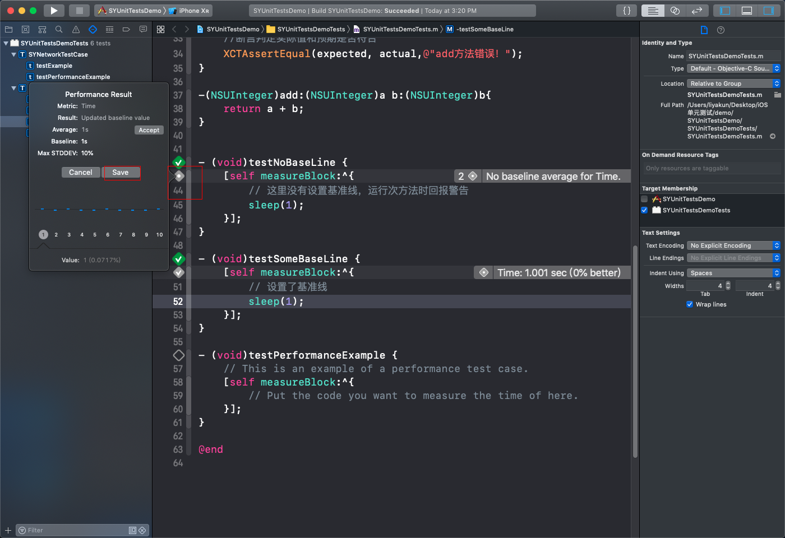

其中的 `Baseline` 为预期代码运行的时间(粒度可设置到 0.00000001s) ，`Max STDDEV` 表示允许的最大浮动值；
如果测试结果超出预设的 `Baseline` + 浮动值 ，则会报错，如下：

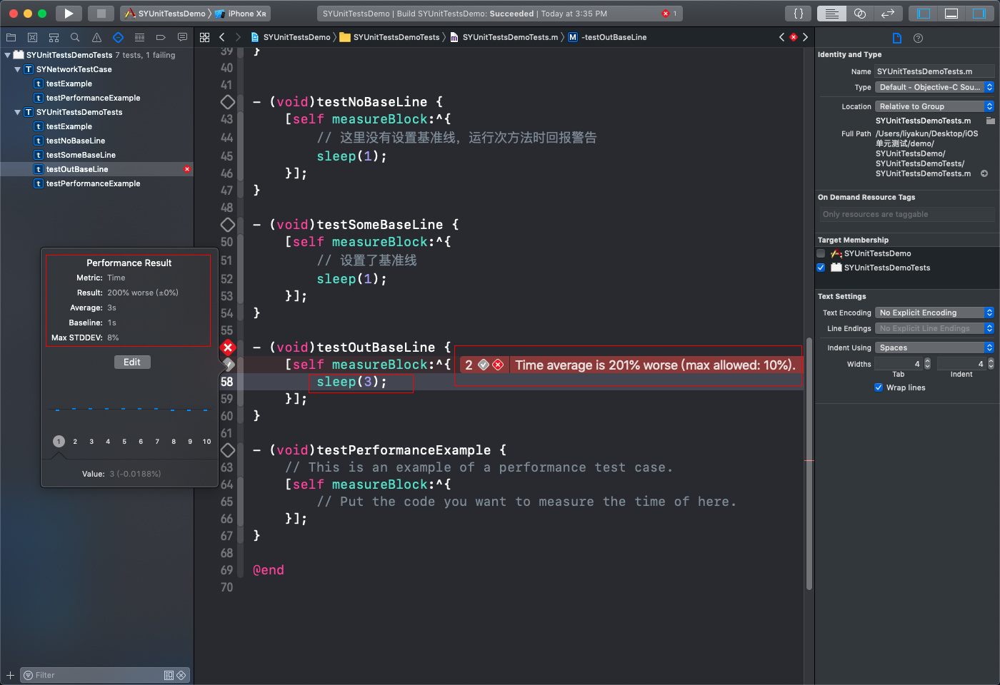

### 四、异步测试

什么时候需要使用异步测试：

* 打开文档

* 在后台线程中执行的服务和网络活动

* 执行动画

* UI 测试时

#### 4.1 期望

> 期望实际上是异步测试，当测试异步方法时，因为结果并不是立刻获得，所以我们可以设置一个期望，期望是有时间限定的的，`fulfill` 表示满足期望


#### 4.1 开始异步测试

异步测试分为3个部分： **新建期望** 、 **等待期望被履行** 和 **履行期望** 。

* XCTestExpectation ：测试期望，可以由测试类持有，也可以自己持有，自己持有测试期望时灵活性更好一些，你可以选择等待哪些期望。

* `- waitForExpectations:timeout:` ：等待异步的期望代码执行，根据初始化方式不同，等待的方法不同。

* `fulfill` ：履行期望，并且适当加入XCTAssertTrue等断言，来验证测试结果。

完整例子(`demo`中的`SYUnitTestsDemoTests.m` 中)如下:

```
- (void)testAsyncExample1 {    
    XCTestExpectation *exp = [self expectationWithDescription:@"这里可以是操作出错的原因描述。。。"];
    NSOperationQueue *queue = [[NSOperationQueue alloc]init];
    [queue addOperationWithBlock:^{
        //模拟这个异步操作需要2秒后才能获取结果，比如一个异步网络请求
        sleep(2);
        //模拟获取的异步操作后，获取结果，判断异步方法的结果是否正确
        XCTAssertEqual(@"a", @"a");
        //如果断言没问题，就调用fulfill宣布测试满足
        [exp fulfill];
    }];
    
    //设置延迟多少秒后，如果没有满足测试条件就报错
    [self waitForExpectationsWithTimeout:3 handler:^(NSError * _Nullable error) {
        if (error) {
            NSLog(@"Timeout Error: %@", error);
        }
    }];
}
```

#### 4.2 异步测试 XCTWaiter

`XCTWaiter` 是 `2017` 年新增的异步测试方案，可以通过代理方式来处理异常情况。

```
XCTWaiter *waiter = [[XCTWaiter alloc] initWithDelegate:self];
    
XCTestExpectation *expect4 = [[XCTestExpectation alloc] initWithDescription:@"asyncTest3"];
    
[TTFakeNetworkingInstance requestWithService:@"product.list" completionHandler:^(NSDictionary *response) {
	XCTAssertTrue([response[@"code"] isEqualToString:@"200"]);
	expect4 fulfill];
}];

XCTWaiterResult result = [waiter waitForExpectations:@[expect4] timeout:10 enforceOrder:NO];

XCTAssert(result == XCTWaiterResultCompleted, @"failure: %ld", result);
```

`XCTWaiterDelegate:` 如果委托是 `XCTestCase` 实例，下方代理被调用时会报告为测试失败。

```
// 如果有期望超时，则调用。 
- (void)waiter:(XCTWaiter *)waiter didTimeoutWithUnfulfilledExpectations:(NSArray<XCTestExpectation *> *)unfulfilledExpectations;

// 当履行的期望被强制要求按顺序履行，但期望以错误的顺序被履行，则调用。
- (void)waiter:(XCTWaiter *)waiter fulfillmentDidViolateOrderingConstraintsForExpectation:(XCTestExpectation *)expectation requiredExpectation:(XCTestExpectation *)requiredExpectation;

// 当某个期望被标记为被倒置，则调用。 
- (void)waiter:(XCTWaiter *)waiter didFulfillInvertedExpectation:(XCTestExpectation *)expectation;

// 当 waiter 在 fullfill 和超时之前被打断，则调用。 
- (void)nestedWaiter:(XCTWaiter *)waiter wasInterruptedByTimedOutWaiter:(XCTWaiter *)outerWaiter;
```

### 五、查看测试结果

在执行测试用例后，Xcode 会返回给我们测试结果，可以通过一下途径查看：

* Test 导航栏

* Issue 导航栏

* 代码编辑器左边栏

* Report 导航栏

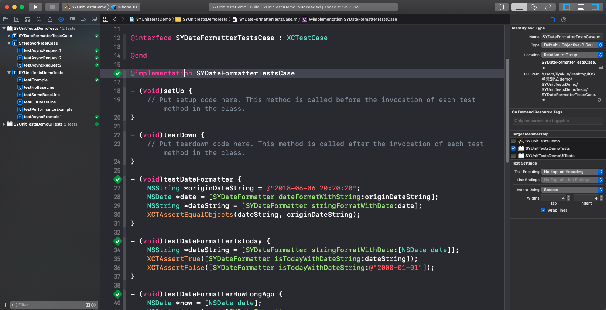

除此之外，我们还可以在 Report 导航栏中查看更加详细的测试报告:

* 测试通过/失败

* 失败原因
* 性能指标
* 截屏
* 嵌套的 activities
* 测试覆盖率
* 
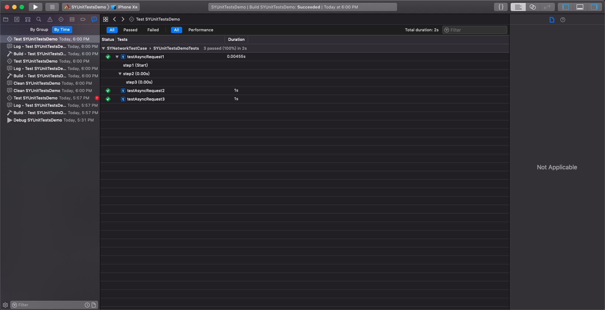

### 六、其他

合理使用测试基类和测试工具类，可以避免大量重复测试代码。
时间转换工具类是一个没有外部依赖的类，当一些对外部有依赖的类需要测试时，
可以尝试 [OCMock](https://github.com/erikdoe/ocmock) ，它能帮助你模拟数据。另外，当你觉得测试框架提供的断言方法无法满足你时，也可以试着使用 [OCHamcrest](https://github.com/hamcrest/OCHamcrest) 。

---------------------------------------

**以下是对 `UI Test`的补充**

---------------------------------------

UI Testing 

# UI Tests

如上文中的集成单元测试一样，可以在创建项目时勾选 `Include UI Tests` 也可以在，`Xcode` 菜单栏中的 `File` -> `New` -> `Target` 选择 `iOS` -> `Test` 下的 `iOS UI Testing Bundle` 进行添加；


什么时候需要使用 UI 测试：

* 单元测试无法覆盖时的补充方案
* 单元测试更精准
* UI 测试覆盖面的更全

UI 测试的步骤：

* step1：与要测试或与逻辑有关的 `UI` 进行互动
* step2：验证 `UIelements` 属性和状态

#### UI Recording

通过 `UI Recording` ，可以将你操作手机的行为记录下来，并且转换成代码，可以帮助你快速生成 `UI` 测试代码。

选中 `UI` 测试类，你能再下方看到一个小红点，点击小红点开始录制你的交互。


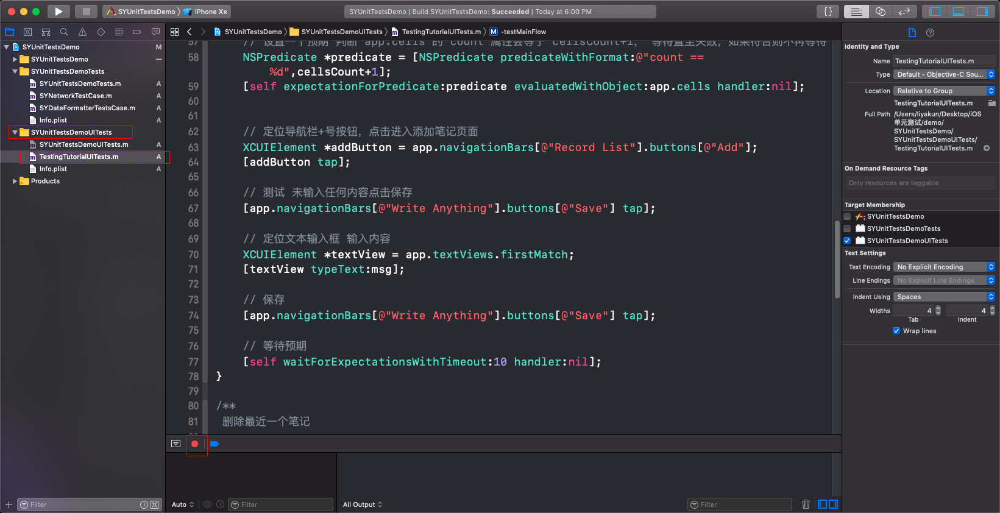

在你进行交互时，`Xcode` 会自动转化成代码，你可以借此创建新的测试代码，也可以以此拓展已经存在的测试代码。当然它也不是十分完美，并不是总能如你所愿，还需要你做一些处理，比如说自动生成的代码过于繁琐，你可以用一些更简洁的代码实现。即使这样，`UI Recording` 也是非常高效的方式。

## UI 测试相关的类

#### 1. XCUIApplication

> `XCUIApplication` 可以返回一个应用程序实例，然后你就可以通过测试代码启动应用程序。

```
// 返回 UI 测试 Target 设置中选中的 Target Application 的实例
- (instancetype)init;
	
// 根据 bundleId 返回一个应用程序实例
- (instancetype)initWithBundleIdentifier:(NSString *)bundleIdentifier;
	
// 启动应用程序
- (void)launch;
	
// 将应用程序唤醒至前台，在多程序联合测试下会用到 
- (void)activate;
	
// 结束一个正在运行的应用程序
- (void)terminate;
```
	
#### 2. XCUIElement

应用程序中的 `UI` 控件，控件类型多样，可能是 `Button` , `Cell` , `Window` 等等。该类实例有很多模拟交互的方法，如 `tap` 模拟用户点击事件，`swipe` 模拟滑动事件，`typeText:` 模拟用户输入内容。

在 `UI` 测试中我们需要找到某个空间，可以通过他们的类型来缩小范围，比如当前页面有且只有一个 `UITextView` 控件，你可以通过以下代码来获取：

```
XCUIApplication *app = [[XCUIApplication alloc] init];
[app launch];

// 如果是 Cell 则对应 app.cells 
// firstMatch 返回第一个符合的控件
XCUIElement *textView = app.textViews.firstMatch;

// 模拟用户在 textView 输入内容
[textView typeText:@"input string"];
```

另外还有一种方式通过 `Accessibility identifer` ， `label` ， `title` 等等方式来定位对应的控件，如寻找一个名为 `Add` 的 `button` 。

```
// 需要勾选 Accessibility Enabled ，并且在 Label 一栏填入 Add
XCUIElement *addButton = app.buttons[@"add"];
// 模拟用户点击按钮
[addButton tap];
```
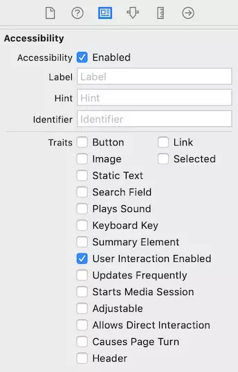

通过类型加 `identifier` 的方式来定位的控件元素的方式，可以满足大多数场景。


#### 3. XCUIElementQuery

`XCUIElementQuery` 是一个用来定位控件元素的类，一般是一组符合筛选条件的元素集合。如 `app.buttons` 即返回 `XCUIElementQuery` 实例，是包含了当前所有的 `button` 的集合，你可以再通过 `XCUIElementQuery` 的方法做下一步的筛选。

`XCUIElementQuery` 常见定位元素的方法：

* count：匹配的数量

	```
	// 当 navigationBars 的 count 等于 1 时，你可以直接定位到 navigationBar
	app.navigationBars.element 
	```
* subscripting：通过 id 来定位
	
	```
	table.staticTexts["Groceries"] 
	```
* index：通过元素的下标来定位
	
	```
	table.staticTexts.elementAtIndex(0) 
	```
定位元素除了利用元素类型、 `Accessibility Identifiers` ，`Predicates` 等筛选方法，还可以结合嵌套的层级关系来帮助定位。


## 进行 UI 测试

要进行 UI 测试需要以下几个步骤：

* step1：新建一个 `UI` 测试 `Target`。

* step2：使用 `UI Recording` 或手写代码，定位 `UI` 元素，并且模拟用户交互事件。

* step3：加入 `XCTAssert` 等断言逻辑，验证测试是否通过。


```
let app = XCUIApplication()
// 启动 app
app.launch()

// 定位元素
let addButton = app.buttons[“Add”]

// 模拟用户交互事件
addButton.tap()

// 验证测试是否通过
XCTTAssertionEqual(app.tables.cells.cout, 1)
```

大多数 `UI` 测试都是基于用户行为驱动，根据设计好的用户的操作流程，测试整个流程的结果。`demo` 中设计了一个简单的笔记，主要有 3 步操作，分别是创建笔记、展示笔记和删除笔记，下面一起来看看如何进行测试。

```
// 测试主流程
- (void)testMainFlow {
	// 启动 app
    XCUIApplication *app = [[XCUIApplication alloc] init];
    [app launch];
    
    // 添加笔记
    [self addRecordWithApp:app msg:@"今天天气真好！🌞"];
    [self addRecordWithApp:app msg:@"今天詹姆斯特别给力，带领球队走向胜利。✌️"];
	
    while (app.cells.count > 0) {
    	  // 删除笔记  
        [self deleteFirstRecordWithApp:app];
    }
}

/**
 添加笔记

 @param app app 实例
 @param msg 笔记内容
 */
- (void)addRecordWithApp:(XCUIApplication *)app msg:(NSString *)msg {
	// 暂存当前 cell 数量
    NSInteger cellsCount = app.cells.count;
    
    // 设置一个预期 判断 app.cells 的 count 属性会等于 cellsCount+1， 等待直至失败，如果符合则不再等待
    NSPredicate *predicate = [NSPredicate predicateWithFormat:@"count == %d",cellsCount+1];
    [self expectationForPredicate:predicate evaluatedWithObject:app.cells handler:nil];


	 // 定位导航栏+号按钮，点击进入添加笔记页面 
    XCUIElement *addButton = app.navigationBars[@"Record List"].buttons[@"Add"];
    [addButton tap];
    
    // 测试 未输入任何内容点击保存
    [app.navigationBars[@"Write Anything"].buttons[@"Save"] tap];
    
    // 定位文本输入框 输入内容
    XCUIElement *textView = app.textViews.firstMatch;
    [textView typeText:msg];
    
    // 保存
    [app.navigationBars[@"Write Anything"].buttons[@"Save"] tap];
        
    // 等待预期
    [self waitShortTimeForExpectations];
}

/**
 删除最近一个笔记

 @param app app 实例
 */
- (void)deleteFirstRecordWithApp:(XCUIApplication *)app {
    NSInteger cellsCount = app.cells.count;
    
    
    NSPredicate *predicate = [NSPredicate predicateWithFormat:@"count == %d",cellsCount-1];
    // 设置一个预期 判断 app.cells 的 count 属性会等于 cellsCount-1， 等待直至失败，如果符合则不再等待
    [self expectationForPredicate:predicate evaluatedWithObject:app.cells handler:nil];

	// 定位到 cell 元素
    XCUIElement *firstCell = app.cells.firstMatch;
    
    // 左滑出现删除按钮
    [firstCell swipeLeft];
    
    // 定位删除按钮
    XCUIElement *deleteButton = [app.buttons matchingIdentifier:@"Delete"].firstMatch;
    
    // 点击删除按钮
    if (deleteButton.exists) {
        [deleteButton tap];        
    }
    
    // 等待预期
    [self waitShortTimeForExpectations];

}
```

一下是单元测试运行后的效果图：

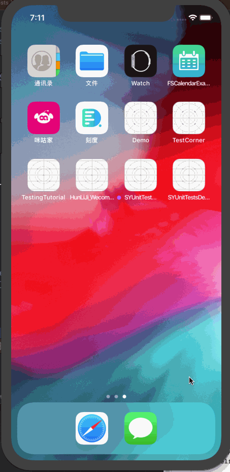

